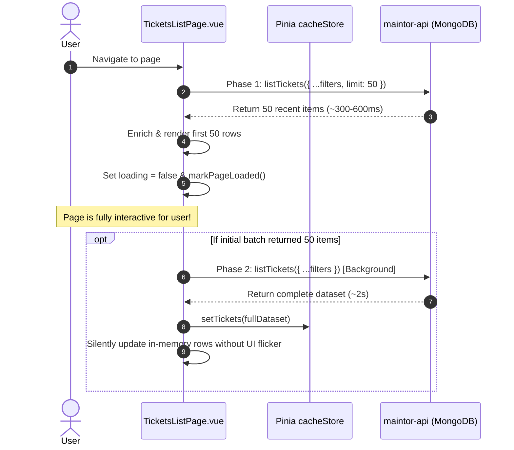

# Page Load & Query Optimization Playbook

This playbook documents the proven architectural patterns, database strategies, and frontend timing practices developed during the optimization of Maintor's high-volume table pages (such as Breakdown Tickets with 5,600+ records).

Follow these patterns when building or optimizing any table, list, or dashboard page across `maintor-app`, `maintor-engineers`, and `maintor-api`.

---

## 1. Core Objectives & Performance Budget

* **Time-to-Interactive (TTI)**: Initial interactive page view must render within **< 600ms**.
* **Zero UI Freezing**: Avoid large blocking network transfers and synchronous CPU-heavy enrichment passes during initial mount.
* **Seamless Background Population**: Users should immediately see and interact with recent data, while the full historical dataset populates in the background without UI flicker, spinner interruptions, or scroll resets.

---

## 2. Pattern 1: Two-Phase Progressive Fetch

### The Problem
Fetching an entire database collection (thousands of items) in one blocking request causes:
- 2.0s–4.5s database wait time.
- Heavy multi-megabyte JSON payload transmission.
- Delayed page render and blank/loading states.

### The Solution
Decouple initial page display from full collection retrieval into two clear phases:



### Component Code Template

```javascript
// Phase 1: Fast initial batch for immediate interactive render
const initialBatchFilters = { ...apiFilters, limit: 50 }
let initialItems = await listItemsAPI(accountId.value, initialBatchFilters)

const enrichedInitial = await enrichAndSort(initialItems)
displayedCount.value = PAGE_SIZE
allItems.value = enrichedInitial

// Release loading states immediately and log accurate load time
loading.value = false
loadingItems.value = false
nextTick(() => markPageLoaded('MyPage', { route: route.fullPath }))

// Phase 2: If more data exists, fetch complete dataset in background
if (initialItems.length === 50) {
  (async () => {
    try {
      const fullItems = await listItemsAPI(accountId.value, apiFilters)
      const enrichedFull = await enrichAndSort(fullItems)
      allItems.value = enrichedFull
      cacheStore.setItems(enrichedFull)
    } catch (bgErr) {
      console.warn('[MyPage] Background fetch warning:', bgErr)
    }
  })()
} else {
  cacheStore.setItems(enrichedInitial)
}
```

---

## 3. Pattern 2: Targeted MongoDB Sorting

### The Problem
Sorting queries by multiple unrelated/unindexed fields simultaneously (e.g., `.sort({ scheduled_date: -1, 'breakdown.start_time': -1, created: -1, ... })`) forces MongoDB to scan all documents across the collection and perform an expensive **in-memory collection sort** before applying `limit`.

### The Solution
Match sorting criteria to the **primary timestamp field** of the requested entity type:

```javascript
if (filters.limit || filters.offset) {
  if (filters.type === 'BREAKDOWN') {
    cursor = cursor.sort({
      'breakdown.start_time': -1,
      created: -1,
      _id: -1
    });
  } else if (filters.type === 'PLANNED') {
    cursor = cursor.sort({
      scheduled_date: -1,
      created: -1,
      _id: -1
    });
  } else {
    cursor = cursor.sort({
      created: -1,
      _id: -1
    });
  }

  if (filters.offset) cursor = cursor.skip(Number(filters.offset));
  if (filters.limit) cursor = cursor.limit(Number(filters.limit));
}
```

### Key Guidelines for MongoDB Queries:
1. **Never use generic multi-field compound sort chains** without a supporting compound index.
2. **Prioritize Single/Targeted Sort Keys**: Sorting on a single primary date allows MongoDB to utilize standard indexes and stream results instantly.
3. **Compound Indexes**: Ensure compound indexes include `{ accountId: 1, type: 1, [primary_date]: -1 }`.

---

## 4. Pattern 3: Accurate Page Load Timer Instrumentation

### The Rules for `pageLoadTimer`:
1. **Never fire `markPageLoaded` on partial or unverified cache reads**: If the page is still going to make a blocking network request, calling `markPageLoaded` beforehand records artificial ~50ms numbers while the user is still waiting for content.
2. **Fire `markPageLoaded` on `nextTick()` after initial batch render**: Trigger the timer immediately after the initial interactive batch (e.g. 50 items) is assigned to the reactive state and mounted in the DOM.
3. **Calibrate Fallback Timers**: Router fallback timeouts (`schedulePageLoadFallback`) should have generous thresholds (e.g., 20,000ms) so they only catch actual unhandled failures and never preempt active data fetches.

---

## 5. Pattern 4: Batch Pre-fetching & O(1) Enrichment Maps

### The Problem
Iterating over hundreds of tickets and making individual API calls or nested array lookups (e.g., `assets.find(a => a.id === ticket.asset_id)`) creates N+1 network traffic and $O(N \times M)$ CPU overhead.

### The Solution
1. **Batch Fetching**: Collect all unique entity IDs (`uniqueSiteIds = [...new Set(tickets.map(t => t.site_id))]`).
2. **Hash Lookup Map**: Build lookup dictionaries (`const sitesMap = { [site.id]: site }`).
3. **O(1) Enrichment**: Map records using instant dictionary key lookups.

```javascript
// Extract unique site IDs needing asset resolution
const uniqueSiteIds = [...new Set(rawTickets.map(t => t.site_id).filter(Boolean))]
const assetsMap = await loadAllAssetsForSites(uniqueSiteIds)

// O(1) enrichment pass
const enriched = rawTickets.map(ticket => ({
  ...ticket,
  asset: assetsMap[ticket.site_id]?.[ticket.asset_id] || null,
  site: sitesMap[ticket.site_id] || null
}))
```

---

## 6. Page Optimization Audit Checklist

When auditing or optimizing a page in Maintor, verify each of the following:

- [ ] **Initial Batching**: Does the initial load request a capped batch (`limit: 50`)?
- [ ] **Background Full Load**: Does the full dataset load non-blockingly without showing modal spinners or resetting user scroll?
- [ ] **Backend Sorting**: Does the MongoDB query use a targeted, index-friendly sort key for pagination?
- [ ] **OpenAPI Spec**: Are `limit` and `offset` documented in `maintor-api/openapi.json`?
- [ ] **Batch Relationships**: Are foreign entities (assets, sites, users, teams) fetched in bulk and mapped via $O(1)$ lookup objects?
- [ ] **Timing Accuracy**: Does `markPageLoaded` fire exactly when initial content is painted, without early cache false-positives?
