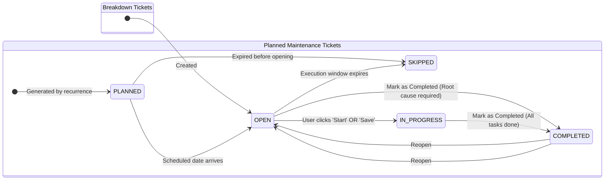

# Ticket Status Lifecycle & Architecture

This document describes the stabilized ticket status lifecycle across the Maintor system (desktop `maintor-app`, mobile `maintor-engineers`, backend API `maintor-api`, and admin `maintor-admin`).

---

## 1. Overview & Principles

Ticket statuses are a core component of Maintor's operational logic, metrics, and workflows. Rather than letting individual organizations disable essential statuses via settings, all supported statuses are standardized and built into the platform:

- **Breakdown Tickets**: Focused on rapid issue response, execution, and root-cause resolution.
- **Planned Maintenance Tickets**: Multi-stage schedule lifecycle tracking tasks from initial planning through execution or expiration.

---

## 2. Supported Statuses by Ticket Type

### Breakdown Maintenance Tickets
| Status | Description | User Actions & Triggers |
| :--- | :--- | :--- |
| `OPEN` | Active breakdown reported and awaiting / undergoing resolution. | Default initial status when ticket is created. Technician logs labor time. |
| `COMPLETED` | Breakdown solved and closed. | User or technician completes the ticket. Requires root cause selection. Reopening returns status to `OPEN`. |

### Planned Maintenance Tickets
| Status | Description | User Actions & Triggers |
| :--- | :--- | :--- |
| `PLANNED` | Generated recurrence template instance scheduled for a future date. | Read-only state awaiting arrival of the scheduled date. |
| `OPEN` | Execution window has opened; ready for technician work. | Scheduled date reached (via hourly scheduler/cron). |
| `IN_PROGRESS` | Work has actively started on the ticket. | Automatically set when technician clicks **Start** (mobile) or clicks **Save** on the ticket (desktop/mobile/API). |
| `COMPLETED` | Maintenance performed and verified. | Requires all checklist tasks checked off and required asset info fields completed. |
| `SKIPPED` | Execution window expired without work being done. | Set by scheduler if the execution window passed without completion. |

---

## 3. Transition Flows & Automation

### Auto-Transition on "Start" & "Save"
- **Clicking "Start"** in mobile (`maintor-engineers`) begins tracking a labor entry and automatically transitions an `OPEN` planned ticket to `IN_PROGRESS`.
- **Clicking "Save"** in desktop (`maintor-app`) or mobile (`maintor-engineers`) automatically transitions an `OPEN` planned ticket to `IN_PROGRESS`.
- **Direct API updates** via `updateTicket` automatically set `status: 'IN_PROGRESS'` if the ticket is `PLANNED` and currently in `OPEN` status.

---

## 4. Future Readiness: `IN_PROGRESS` on Breakdown Tickets

The platform is designed to effortlessly introduce `IN_PROGRESS` to breakdown tickets when needed:
- The configuration toggle `ENABLE_BREAKDOWN_IN_PROGRESS = false` is centralized in both client applications (`settings.js` in `maintor-app` and `TicketFormPage.vue`/`TicketsPage.vue` in `maintor-engineers`).
- The backend API and database schemas natively support `IN_PROGRESS`.
- Flipping this flag to `true` in the future will immediately enable:
  1. `IN_PROGRESS` option in breakdown filters and status chips.
  2. Auto-transitioning breakdown tickets from `OPEN` to `IN_PROGRESS` when clicking **Start** or **Save**.
  3. No breaking API changes or database migrations required.
