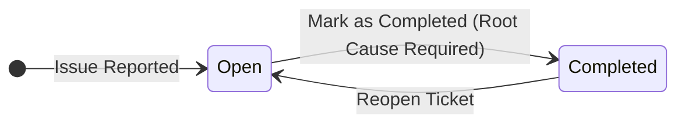
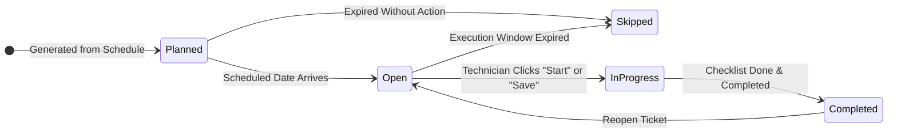

# Understanding Ticket Statuses in Maintor

Ticket statuses are the backbone of maintenance workflow management in Maintor. They provide real-time visibility into what needs attention, what is currently being worked on, and what has been successfully completed.

Maintor distinguishes between two distinct maintenance workflows: **Breakdown Maintenance** (reactive repairs) and **Planned Maintenance** (preventive routines). Each workflow follows a clear, predictable lifecycle tailored to its purpose.

---

## Breakdown Maintenance Statuses

Breakdown tickets represent unexpected equipment failures or urgent issues that require prompt attention. Their status flow is kept streamlined so technicians and managers can focus on swift resolution.

### 1. Open
* **What it means**: An equipment failure has been reported and the ticket is active.
* **What happens**: Technicians can inspect the issue, record findings, and track labor time.
* **Next step**: Once the breakdown is resolved, the ticket is marked as completed.

### 2. Completed
* **What it means**: The equipment has been repaired and returned to operational status.
* **Requirements**: When completing a breakdown ticket, a **Root Cause** must be selected to help track failure patterns and prevent recurrence.
* **Reopening**: If further work is required after completion, managers or technicians can reopen the ticket, returning it to **Open**.

---

## Planned Maintenance Statuses

Planned maintenance tickets are generated automatically from recurring maintenance templates (e.g., weekly inspections, monthly servicing). They move through a multi-stage lifecycle that reflects the planning, execution, and validity window of each routine.

### 1. Planned
* **What it means**: The maintenance routine has been scheduled for a future date.
* **What happens**: The ticket appears in the work schedule and calendar for workload visibility, but is not yet due for execution.

### 2. Open
* **What it means**: The scheduled date has arrived and the execution window is now active.
* **What happens**: The ticket is ready for technicians to review checklists, gather parts, and begin work.

### 3. In Progress
* **What it means**: Active work on the maintenance routine has begun.
* **How it gets here**: Moving from **Open** to **In Progress** is completely automated — as soon as a technician taps **Start** on the mobile app to track labor time, or clicks **Save** after making updates to the ticket, Maintor automatically sets the status to **In Progress**.

### 4. Completed
* **What it means**: The maintenance task was fully executed and verified.
* **Requirements**: All checklist items must be checked off, and any required asset inspection fields must be filled in before the ticket can be completed.

### 5. Skipped
* **What it means**: The maintenance window expired before the routine could be performed.
* **Why this matters**: Automatically marking unperformed overdue tasks as **Skipped** prevents overlapping backlog tickets from piling up when the next scheduled recurrence arrives.

---

## Status Comparison at a Glance

| Status | Breakdown Tickets | Planned Maintenance Tickets | Meaning & Usage |
| :--- | :---: | :---: | :--- |
| **Planned** | — | ✅ | Scheduled for a future date. |
| **Open** | ✅ | ✅ | Active and ready for technician action. |
| **In Progress** | — | ✅ | Work has actively started (auto-set on Start or Save). |
| **Completed** | ✅ | ✅ | Maintenance finished and verified. |
| **Skipped** | — | ✅ | Maintenance window expired before execution. |

---

## Standardized for Reliability

Statuses in Maintor are built-in and standardized across all interfaces (Desktop web app and Technician mobile app). This ensures that dashboard metrics, work schedule calendars, downtime tracking, and team activity feeds always reflect an accurate, synchronized picture of your facility's maintenance operations.
